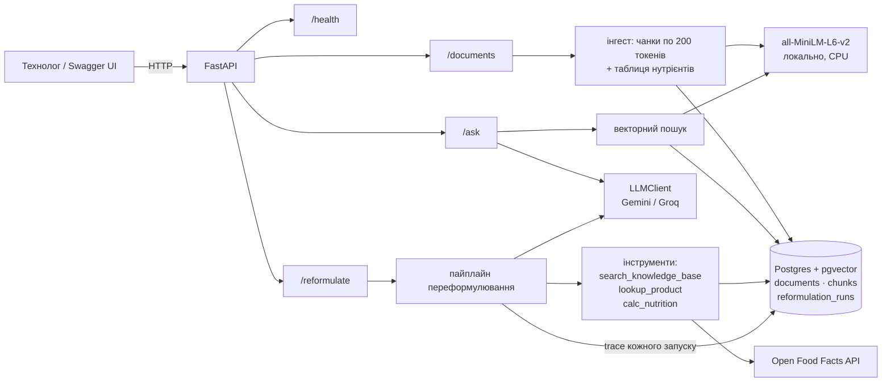
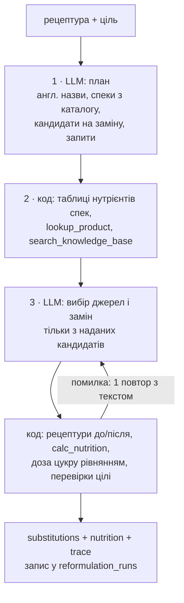

# Reformulation Assistant

[](https://github.com/zarovnyi22/pet/actions/workflows/ci.yml)

HTTP-сервіс для технолога харчового R&D: подаєш рецептуру і ціль — прибрати алерген, зменшити
цукор або зробити продукт веганським, — отримуєш заміни інгредієнтів із джерелами (внутрішні
спеки, звіти з пробних варок, Open Food Facts) і нутрієнти на 100 г до/після, пораховані
кодом, а не моделлю. Плюс RAG-пошук по базі знань з цитатами.

Pet-проєкт під вакансію Backend & AI Engineer: FastAPI, PostgreSQL + pgvector, Docker, LLM
(Gemini, запасний Groq), RAG і агент з інструментами без фреймворків. Фронтенду немає — демо
через Swagger UI.

## Архітектура



`/reformulate` — фіксований пайплайн: LLM планує і обирає, код збирає дані й рахує.



## Запуск за 3 команди

Потрібні лише Docker і ключ [Google AI Studio](https://aistudio.google.com/apikey) (безкоштовний).

```bash
cp .env.example .env                                        # впиши GEMINI_API_KEY=...
docker compose up --build -d                                # db + api; перша збірка ~5 хв
docker compose exec api python -m app.ingest data/corpus/   # 23 документи в базу знань
```

Далі: Swagger — http://localhost:8000/docs, здоров'я — `curl localhost:8000/health`.
Алергени спек розбираються при інгесті в `documents.allergens`; база, заінгещена до цього,
дозаповнюється на старті з уже збереженого тексту. Спеки, збережені ще без таблиці алергенів,
лишаються «невідомими» (і `/reformulate` їх відхиляє), поки не перезапустиш `make ingest`.
Те саме коротко: `make up`, `make ingest`, `make health`; тести — `make test` (ruff + pytest у
контейнері, без мережі й без ключів LLM, на окремій базі `reformulation_test`), логи — `make logs`.
CI (GitHub Actions, `.github/workflows/ci.yml`) на кожен push: Postgres + pgvector як service
container, залежності через `uv`, ruff і pytest без ключів LLM, збірка Docker-образу без push.

## Приклади запитів

```bash
curl localhost:8000/health
# {"status":"ok","db":"ok","llm_provider":"gemini"}

curl -X POST localhost:8000/documents -H 'content-type: application/json' -d '{
  "doc_id": "note-demo", "title": "Demo note", "doc_type": "guideline",
  "content": "Reduce sucrose in steps of 10% and replace the mass with polydextrose."}'
# {"doc_id":"note-demo","chunks_created":1}

curl -X POST localhost:8000/ask -H 'content-type: application/json' \
  -d '{"question": "What can replace eggs in a sponge cake and at what dosage?", "top_k": 5}'
# {"answer": "... Aquafaba (45 g per 1 whole egg ...) [spec-aquafaba]. ... Flax gel
#   (7 g ground flaxseed + 37 g water) [spec-whole-egg] ...",
#  "sources": [{"doc_id": "spec-aquafaba", "title": "...", "chunk_text": "...", "score": 0.6958}, ...]}

curl -X POST localhost:8000/reformulate -H 'content-type: application/json' \
  -H 'X-Request-ID: readme-demo' -d '{
  "product_name": "Полуничний йогурт 2.5%",
  "ingredients": [{"name": "молоко 2.5%", "grams": 800}, {"name": "цукор", "grams": 90},
                  {"name": "полуниця заморожена", "grams": 100}, {"name": "закваска", "grams": 10}],
  "goal": "reduce_sugar", "goal_params": {"percent": 30}}'
```

Відповідь `/reformulate` (реальний запуск, скорочено):

```json
{
  "substitutions": [
    {"original": "цукор", "replacement": "Erythritol (E968)", "grams": 20.6,
     "sources": ["spec-erythritol"], "confidence": "medium", "rationale": "..."},
    {"original": "цукор", "replacement": "Polydextrose (E1200)", "grams": 20.6,
     "sources": ["spec-polydextrose"], "confidence": "medium", "rationale": "..."}
  ],
  "allergens_before": ["milk"],
  "allergens_after": ["milk"],
  "nutrition_per_100g": {
    "before": {"kcal": 82.45, "protein_g": 2.39, "fat_g": 2.04, "carbs_g": 13.71, "sugar_g": 13.26},
    "after":  {"kcal": 68.03, "protein_g": 2.39, "fat_g": 2.04, "carbs_g": 11.73, "sugar_g": 9.14}
  },
  "warnings": ["Monitor total polyol levels ...", "Texture and mouthfeel may slightly change ..."],
  "trace": ["... див. нижче"]
}
```

Помилки завжди в одному форматі: `{"error": {"code": "...", "message": "..."}}`; помилки агента
(`agent_timeout` 504, `agent_invalid_output` 502, `llm_unavailable` 503) додають поруч `trace`.
Помилки LLM: `llm_not_configured` 503 (ключ не задано), `llm_invalid_key` 503 (ключ
неправильний: «GEMINI_API_KEY is invalid»; без повтору), `llm_rate_limited` 503 (квота),
`llm_unavailable` 503 (перевантаження, один повтор), `llm_timeout` 504, `llm_error` 502 (інша
відповідь провайдера).

## Як працює агент — на прикладі trace

Той самий запуск `reduce_sugar`: кожен крок є в полі `trace` відповіді, у таблиці
`reformulation_runs` і в логах (скорочено):

```text
step stage type        tool                   що сталося
1    1     llm_call    plan                   модель: англ. назви, спеки для 4 інгредієнтів, кандидати
2    2     tool_call   spec_tables            таблиці нутрієнтів 7 спек (цукор, молоко, еритрит, ...)
3    2     tool_call   search_knowledge_base  "sugar reduction in yogurt bulking agents"        112 ms
4    2     tool_call   search_knowledge_base  "erythritol polydextrose in fermented dairy ..."  112 ms
5    3     llm_call    choose                 модель: джерела нутрієнтів + еритрит і полідекстроза
6    3     tool_call   calc_nutrition         до:    82.45 kcal, цукор 13.26 г/100 г, rejected: []
7    3     correction                         sugar dose computed by code: 41.1 g of 'цукор'
                                              replaced (the model proposed 54.0 g)
8    3     tool_call   calc_nutrition         після: 68.03 kcal, цукор 9.14 г/100 г (−31%)
```

Що тут видно: модель двічі відповіла мовою (план і вибір), а всі числа — з таблиць спек через
код; дозу цукру модель запропонувала «на око» (54 г), код розв'язав рівняння з урахуванням
лактози й полуниці і поставив рівно стільки, щоб цукор упав на ≥30% (41.1 г, −31%).

Дебаг у продакшені — за `X-Request-ID`: той самий id є в заголовку відповіді, у кожному рядку
JSON-логів (HTTP-запит, виклики LLM з таймінгом, кожен крок агента) і в `reformulation_runs`:

```bash
docker compose logs api --no-log-prefix | grep readme-demo
# {"ts": "...", "level": "INFO", "logger": "app.llm", "message": "llm request",
#  "request_id": "readme-demo", "provider": "gemini", "status": 200, "duration_ms": 7981}
# {"ts": "...", "logger": "app.agent", "message": "agent llm_call", "request_id": "readme-demo",
#  "step": 1, "stage": 1, "tool": "plan", ...}

docker compose exec db psql -U postgres -d reformulation -c \
  "SELECT id, status, duration_ms, jsonb_array_length(trace) FROM reformulation_runs ORDER BY id DESC LIMIT 5"
```

## Що б зробив далі

1. **Сліди алергенів і перехресний контакт:** зараз код звіряє алергени, які джерело прямо
   називає; «may contain» і лінії виробництва (є в `guideline-allergen-policy`) — наступний
   крок для реального маркування.
2. **Оцінка якості RAG** (`eval/questions.jsonl` + recall@5) і гібридний пошук (tsvector +
   RRF): векторний пошук погано знаходить таблиці й числа — це показав агент.
3. **CI** (GitHub Actions: `docker compose run --rm test` уже самодостатній) і деплой у
   Kubernetes (kind) з liveness/readiness на `/health`.
4. **Запасний LLM для `/reformulate`:** Groq free tier (8K токенів/хв) не вміщає навіть
   пайплайн без платного тарифу; або менший контекст на виклик, або інший провайдер.
5. **Моделювання процесу:** `calc_nutrition` рахує сировинну суміш; для йогурту варто
   врахувати ферментацію лактози, для випічки — втрату води.

## Рішення і компроміси

### `/reformulate` — фіксований пайплайн, а не вільний цикл агента (свідомий компроміс)

За планом агент — вільний цикл tool calling (`app/agent/loop.py`, ≤6 ітерацій, 60 с). Він
реалізований і покритий тестами, але на живому Gemini не стабілізувався: у серії прогонів
демо-йогурту на три цілі проходило 1–2 з 3. Trace і `reformulation_runs` показали чому:
модель сама переносила числа (нутрієнти, дози цукру), помилялась, а кожна перевірка, що це
ловила, коштувала ще однієї з 6 ітерацій — `reduce_sugar` підбирав дозу цукру методом спроб і
не вкладався в ліміт.

Тому, як передбачено запасним варіантом у CLAUDE.md, `/reformulate` працює як фіксований
пайплайн (`app/agent/pipeline.py`): LLM робить лише те, що потребує мови, код — решту.

1. **LLM, план:** англійські назви інгредієнтів, зіставлення з каталогом спек, кандидати на
   заміну, пошукові запити.
2. **Код:** таблиці нутрієнтів спек, `lookup_product` для решти, `search_knowledge_base` для
   контексту (trial reports, guidelines).
3. **LLM, вибір:** джерела нутрієнтів і заміни — тільки з наданих кандидатів.
4. **Код:** рецептури до/після з нутрієнтами обраних джерел, `calc_nutrition`, доза цукру для
   `reduce_sugar` (лінійне рівняння з компенсацією маси, з урахуванням лактози), перевірки
   цілі й алергенів, `confidence`, попередження про білок і відсутні дані.

Два виклики LLM (плюс максимум один повтор кожного), модель не передає жодного числа, тож
«нутрієнти з повітря» неможливі за побудовою. Інструменти, trace, `reformulation_runs` і
формат відповіді ті самі; цикл лишається в репозиторії як перша спроба з тестами на FakeLLM.

Що варто знати про пайплайн:

- **Ліміти.** Щонайбільше 4 виклики LLM за запуск (план + вибір, кожен з одним повтором при
  невалідній відповіді) — у межах 6 ітерацій зі спеки; загальний ліміт часу 60 с
  (`AGENT_TIMEOUT_SECONDS`). `AGENT_MAX_ITERATIONS` тепер діє лише на цикл у `loop.py`.
- **Trace.** Той самий формат, що в циклу: `iteration` — номер етапу пайплайна (1 план,
  2 збір даних, 3 вибір разом із розрахунком — кожен вибір одразу перевіряється
  `calc_nutrition`, тож повтор рахує заново, 4 фінальні правки); у кроків `llm_call` поле
  `tool` — призначення виклику (`plan` / `choose`), `result` — розібрана відповідь моделі,
  `duration_ms` — час відповіді LLM; `correction` — що код виправив сам (доза цукру,
  `confidence`, неперевірені джерела) замість повтору.
- **Алергени звіряються з даними.** Код бере алергени й веганський статус кожного інгредієнта
  з його джерела — таблиці `Allergens`/`Vegan` спеки, тієї колонки, з якої взято нутрієнти
  (bulk-закваска — `milk`, рослинна DVS — `none`), або тегів Open Food Facts — і: додає
  алергени, які модель пропустила (`correction`); для `remove_allergen` відхиляє вибір, якщо
  джерело інгредієнта «після» ще містить цей алерген; для `make_vegan` — якщо джерело позначає
  його як не веганський. **Невідомо ≠ можна:** інгредієнт без джерела чи без даних у спеці —
  відмова вибору, а якщо й повтор не виправив — явне попередження і `confidence: low`; для
  Open Food Facts з неповними даними — попередження і `confidence: low`. «May contain»
  (сліди) поки не враховуються.

### Чанки по 200 токенів, а не 400

Початковий план — 400 токенів із перекриттям 50. Але `all-MiniLM-L6-v2` обрізає вхід на
**256 токенах**: у чанку на 400 токенів ембедер «бачив» би лише перші ~64%, а хвіст чанка
потрапляв би в базу і у відповідь `/ask`, але ніяк не впливав би на пошук. Тому:

- розмір чанка — **200 токенів, перекриття 40** (20%); з `[CLS]`/`[SEP]` — 202, із запасом до 256;
  значення в `app/config.py` (`CHUNK_SIZE_TOKENS`, `CHUNK_OVERLAP_TOKENS`), `Settings` не
  дозволить виставити чанк більший за 254;
- токени рахує **токенізатор самої моделі** (WordPiece), а не пробіли: одне англійське слово —
  у середньому ~1.3 токена, числа й одиниці («0.01–0.03%», «mg/kg») — значно більше;
- текст чанка — **зріз оригінального тексту** за offset-ами токенів, а не `decode()` з id:
  токенізатор uncased, і decode віддав би в цитати текст у нижньому регістрі з пробілами
  навколо пунктуації.

`app/chunking.py` — чиста функція, токенізатор передається ззовні, тому тести не
завантажують модель.

### `/ask` українською — переклад запиту перед пошуком

Корпус і `all-MiniLM-L6-v2` англомовні, тож українське питання, векторизоване як є, майже
не знаходить потрібних документів. Тому перед пошуком `/ask` робить один виклик LLM, який
перекладає питання в англійський пошуковий запит. Для питань лише з ASCII-літерами цей виклик
пропускається. У промпт відповіді йде оригінальне питання, і відповідь приходить мовою
питання. Ціна — другий виклик LLM на кожне неанглійське питання.

Заміри на `eval/questions.jsonl`: 10 питань, кожне англійською й українською, для кожного
один очікуваний `doc_id`. `make eval` рахує лише пошук, `make eval-translate` — з перекладом.

| Питання (10) | recall@5 |
|---|---|
| en | 10/10 (100%) |
| uk, як є (до) | 3/10 (30%) |
| uk → en через LLM (після) | 9/10 (90%) |

Набір із 10 питань ми склали по корпусу самі, тож це перевірка напрямку, а не бенчмарк.
Єдиний промах показує, що переклад може стиснути деталі питання: у запиті про мафіни
(`trial-muffin-sugar-50`) загубились «половина цукру» і «лише еритрит». Наступний крок —
багатомовна модель ембедингів `multilingual-e5-small` (теж 384 виміри, але потребує
переінгесту і префіксів `query:`/`passage:`) або гібридний пошук.

### Повторний інгест — одна транзакція

`upsert documents` → `DELETE chunks` → `INSERT chunks` виконуються в одній транзакції.
Якщо вставка впаде, старі чанки лишаються на місці, і документ не зникне з пошуку наполовину.
Upsert блокує рядок документа, тому два одночасні інгести одного `doc_id` не перемішують
чанки. Ембединги рахуються **до** транзакції, щоб не тримати її відкритою під час роботи
моделі на CPU.

### Запасний LLM на Groq — тільки для `/ask`; `/reformulate` — тільки Gemini

Llama-моделей на Groq для нашого ключа вже немає (`llama-3.3-70b-versatile` → 404
`model_not_found`), тому запасний провайдер за замовчуванням використовує `openai/gpt-oss-120b`
(`GROQ_MODEL`). Перемикання Gemini ↔ Groq перевірено вручну заміною однієї змінної
`LLM_PROVIDER`: `/ask` працює на обох провайдерах без змін коду.

`/reformulate` на free tier Groq не вміщається: ліміт **8K токенів на хвилину** (TPM), а агент
на кожному ході заново надсилає всю історію. Один запуск — **~25K вхідних токенів** (виміряно
`countTokens` на записаному сценарії `remove_allergen`, після скорочення контексту: top_k 3,
чанки до 600 символів, мінімум полів з Open Food Facts; до скорочення було ~31K):

| Хід | 1 (промпт + інструменти) | 2 | 3 | 4 | 5 (фінал) | Разом |
|---|---|---|---|---|---|---|
| Вхідні токени | 1 922 | 3 761 | 5 804 | 6 364 | 6 978 | 24 829 |

Уже третій хід разом із першими двома перевищує 8K, тому запуск падає з 503
`llm_rate_limited` на 2–4 ітерації навіть після хвилинної паузи. `qwen/qwen3.8-27b` на Groq має
той самий ліміт 8K TPM і падає так само. Тому `/reformulate` працює тільки на Gemini; на
платному tier Groq або з моделлю з вищим TPM перемикання — та сама одна змінна.

### Корпус — 23 документи, покриває демо-йогурт

Початкові 20 документів були про випічку (молоко 3.5%, яйце, борошно), а демо-рецептура в SPEC —
полуничний йогурт. Без відповідних спек агент брав нутрієнти з випадкових товарів Open Food
Facts (суха хлібна закваска на 338 kcal замість йогуртової) або з пам'яті. Тому додано три
`ingredient_spec`: `spec-milk-2-5` (молоко 2.5%, нутрієнти, заміни у ферментованих продуктах),
`spec-strawberry-frozen` і `spec-yogurt-starter` (молочні й рослинні закваски, алерген milk у
bulk-заквасці, веганський статус). Тепер кожен інгредієнт демо має внутрішню спеку, пріоритетнішу
за Open Food Facts.

### Нутрієнти в `calc_nutrition` звіряються з джерелом у коді

Правило промпту «нутрієнти лише з бази знань або Open Food Facts» модель порушувала: брала
цифри з пам'яті або цитувала один товар, а цифри брала з іншого. Тому кожен інгредієнт у
`calc_nutrition` має `nutrients_source`, а `Toolbox` пам'ятає, що модель **реально бачила** в
цьому запуску, і приймає лише значення, які з цим збігаються (допуск 1% на округлення):

- `off:<code>` — нутрієнти, які повернув `lookup_product` для цього товару;
- `doc_id` спеки — її таблиця нутрієнтів (див. нижче); для документів без таблиці — числа з
  тексту показаних чанків.

Непідтверджене значення не рахується (потрапляє в `missing`), а в `rejected` пишеться, яке і
чому, з підказкою, що зробити (наприклад, точні значення з таблиці). Так «нутрієнти з повітря»
видно в trace, а не лише сподіваємось на промпт.

### Таблиця нутрієнтів спеки — окрема колонка `documents.nutrients_per_100g`

Відхилення від схеми з трьох таблиць у CLAUDE.md: у `documents` додано колонку `JSONB`
окремою міграцією `002_nutrients.sql` — застосовані міграції не редагуються, кожна зміна
схеми йде новим файлом (`app/db.py` виконує всі `*.sql` за порядком на старті). Причина — векторний
пошук майже ніколи не повертав чанк із таблицею «Nutrients per 100 g» (у top-3 потрапляли
функція, дозування, заміни), тож модель або вгадувала цифри, або витрачала ітерації на
повторні пошуки таблиці. Тепер таблиця розбирається при інгесті і приходить у результаті
`search_knowledge_base` разом із будь-яким чанком цієї спеки. Таблиці з кількома колонками
(bulk vs freeze-dried закваска) зберігаються по колонках.

### `lookup_product` повертає до 3 продуктів, а не перший знайдений

Перший результат пошуку Open Food Facts часто нерелевантний (на «coconut milk» першим був
coconut cream на 246 kcal), тому агент отримує до трьох кандидатів із нутрієнтами і сам
обирає, на який послатися.

### `calc_nutrition` рахує суміш до ферментації

Нутрієнти — зважене середнє сировини, без моделювання процесу: закваска переводить 20–30%
лактози в молочну кислоту, а інструмент і далі рахує її як цукор. Тому для йогурту з
`docs/SPEC.md` виходить 81.9 kcal і 13.2 г цукру на 100 г, а не 78 і 12.1 з прикладу
відповіді в SPEC; для порівняння «до/після» це не важливо, бо обидві цифри рахуються однаково.
